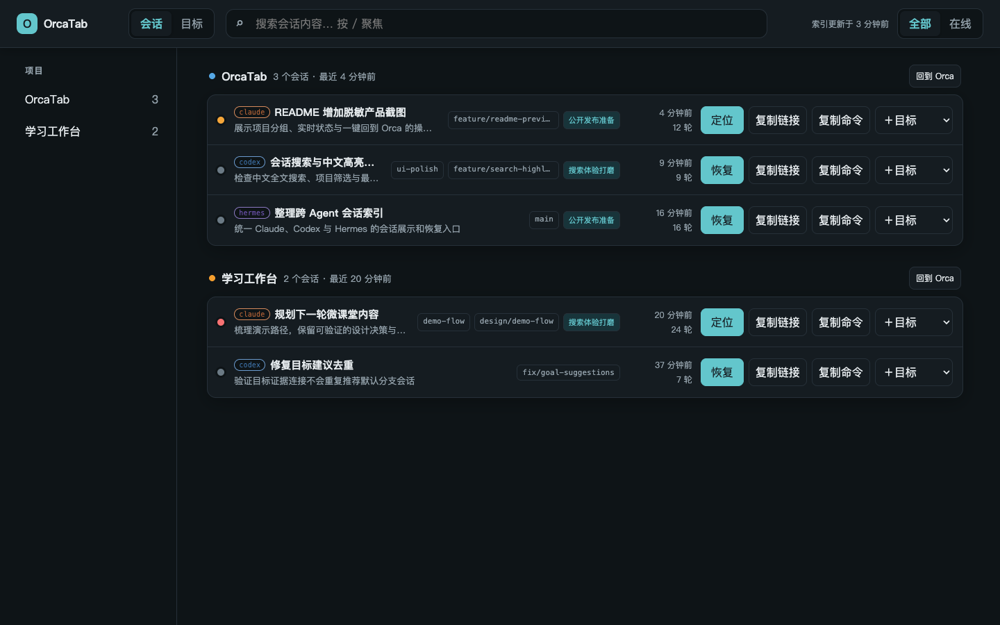

# OrcaTab

Claude Code 会话面板：按项目聚合、最近输入倒序、零 token 摘要、`orcatab://claude/<sid>` 一键回到 Orca 的 tab、中文全文搜索。



> 截图使用纯虚构演示数据，不包含真实会话、用户身份或本机路径。

## 本地运行

需要 macOS 与 `/opt/homebrew/bin/bun`。服务只监听本机回环地址：

```sh
bun run src/main.ts
```

打开 http://127.0.0.1:47831。检查改动使用：

```sh
bun x tsc --noEmit
bun test
```

## 卡片内发送输入

Orca 报告为 `done`（已就绪、等待用户输入）的在线会话，卡片上会直接出现输入框：回车即通过
`orca terminal send --terminal <handle> --text <text> --enter` 送进该会话，不必先跳转。

- 只有 `done` 会出现输入框；`waiting`（工具权限确认）等状态一律不发。
- 只收单行文本，不接受换行与控制字符——`--enter` 是逐字键入语义，换行会在 TUI 里变成提前提交。
- 发送前会用卡片上的 handle / 状态与服务端最新快照比对，不一致返回 409 并提示刷新。
- 发出后按 Orca 的 tab 状态判定回执：20 秒内没离开 `done` 就标为「未确认送达」，
  卡片上保留「复制上次输入」把原文取回来重发。
- 写操作校验 `Sec-Fetch-Site` / `Origin`，只接受同源请求。

## 挂在会话上的想法队列

会话卡上的「＋想法」把一句话直接变成任务板上的一个任务，并挂回这个会话——想法不打断心流地
落到板子上，卡片上留一条「待落地」，等有空再落地。

- 任务真身在**任务板**上；OrcaTab 只存链接和一份快照（`~/.orcatab/boards.db`），
  板子离线时队列照常显示，只是标题可能是旧的。
- 一个仓库第一次捕捉时选一次任务板项目，之后这个仓库下所有会话都记住它。
  卡片上的项目名可以点开重选。
- 「移除」只解除与这个会话的关联，不删除板子上的任务。
- 接 kansession 时，捕捉成功后还会反向调它的 `POST /api/agent-session/link`，
  把这个会话作为证据挂到刚建的任务上——于是同一次捕捉在两边都留痕。反写失败不影响任务本身。

不配任何任务板也能用：默认落到 OrcaTab 自带的本地板子，项目就是 OrcaTab 自己的项目列表。
接外部板子用 `ORCATAB_BOARDS`：

```sh
export ORCATAB_BOARDS='[{"id":"kansession","name":"kansession","kind":"kansession",
  "baseUrl":"http://127.0.0.1:1337","webUrl":"http://localhost:5173","apiKey":"<API key>"}]'
```

`apiKey` 在 kansession 的 Settings → Account → Developer 里签发，走 `x-api-key`。
接口契约与新增适配器的写法见 [`docs/TBP.md`](docs/TBP.md)。

## 注册 orcatab://

在仓库根目录运行安装脚本，它会生成 `~/Applications/OrcaTab.app` 并注册 URL scheme：

```sh
bash scheme/install.sh
open "orcatab://claude/<sid>"
```

链接会优先请求本机 OrcaTab 服务；服务不可用时，handler 会调用 Bun CLI 回退。页面的「复制链接」得到 `orcatab://claude/<sid>`，「复制命令」得到 `claude --resume <sid>`。卸载使用：

```sh
bash scheme/uninstall.sh
```

## pm2 托管

进程入口固定为 `src/main.ts`。启动并保存开机恢复配置：

```sh
pm2 start ecosystem.config.cjs && pm2 save
```

日志写入 `~/.orcatab/logs/`。配置变更后由维护者重启进程。

## 环境变量

| 变量 | 默认值 | 用途 |
|---|---|---|
| `ORCATAB_PORT` | `47831` | 本机 HTTP 服务端口 |
| `ORCATAB_CLAUDE_DIR` | `~/.claude` | Claude Code 只读数据目录 |
| `ORCATAB_DATA_DIR` | `~/.orcatab` | SQLite 索引数据目录 |
| `ORCATAB_ORCA_BIN` | `orca` | Orca CLI 可执行文件名或路径 |
| `ORCATAB_BOARDS` | 空 | 任务板适配器配置（JSON 数组），见 `docs/TBP.md` |
| `ORCATAB_ORCHESTRATION_DB` | `~/Library/Application Support/orca/orchestration.db` | Orca 编排状态（只读），用于把被指派的会话折叠到协调者下 |

详细设计与数据契约见 [`docs/PLAN.md`](docs/PLAN.md)。
